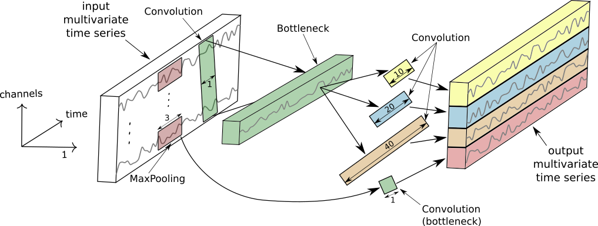
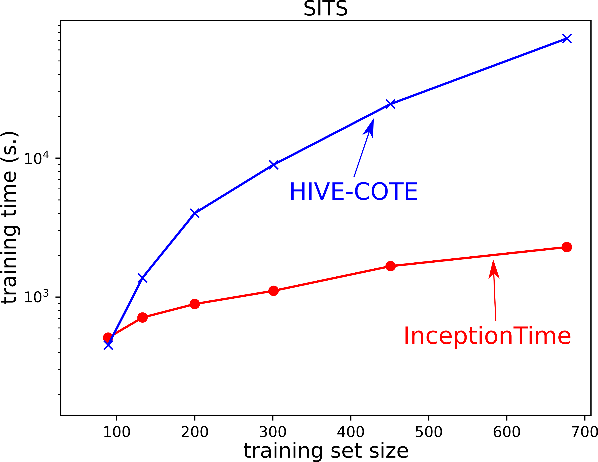
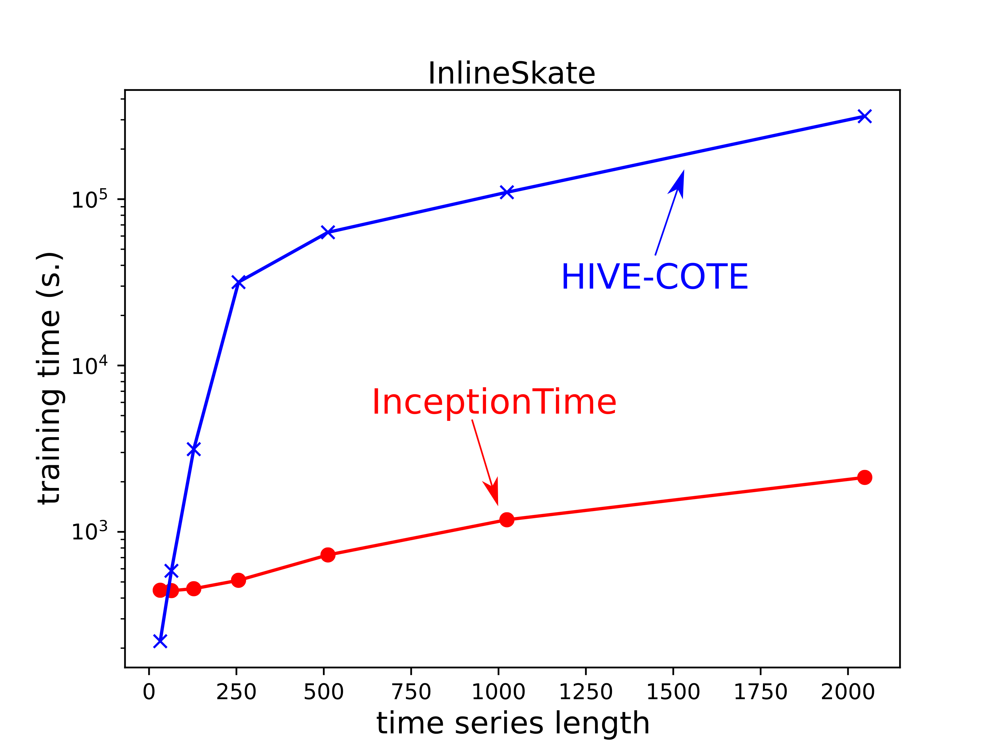
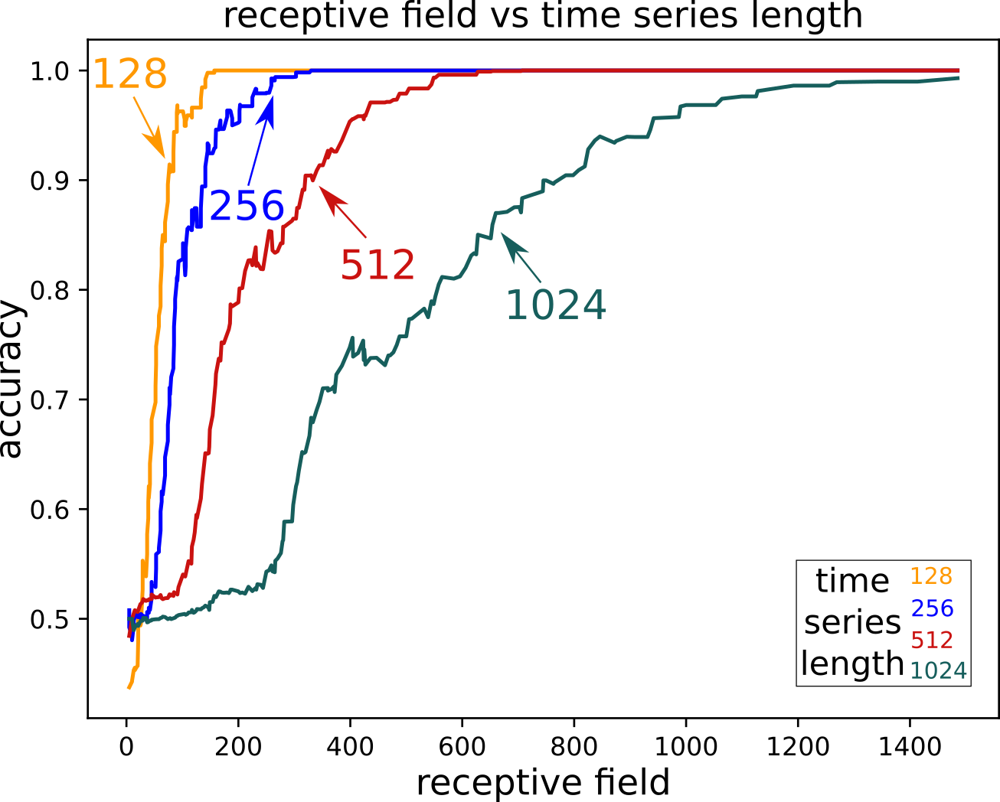
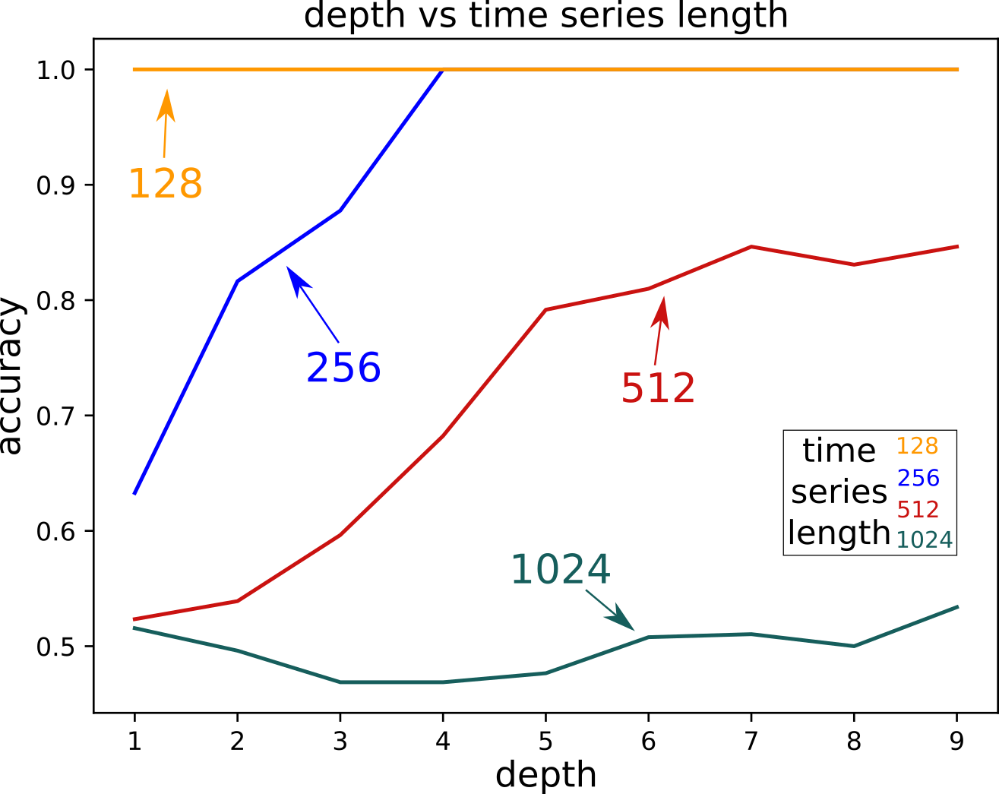

# InceptionTime: Finding AlexNet for Time Series Classification

这是我们发表在 [Data Mining and Knowledge Discovery ](https://www.springer.com/journal/10618)，也可在 [ArXiv](https://arxiv.org/pdf/1909.04939.pdf) 上找到。

## Inception 模块



## 数据

本项目中使用的数据来自[UCR/UEA 档案](http://timeseriesclassification.com/TSC.zip)。
我们使用了 [此处] (https://www.cs.ucr.edu/~eamonn/time_series_data/) 列出的 85 个数据集。

## 依赖

您需要安装 [requirements.txt](https://github.com/hfawaz/InceptionTime/blob/master/requirements.txt) 文件中的以下软件包。

## 代码

代码划分如下：

* [main.py](https://github.com/hfawaz/InceptionTime/blob/master/main.py) python 文件包含运行实验所需的代码。
* [utils](https://github.com/hfawaz/InceptionTime/tree/master/utils) 文件夹包含读取数据集和可视化绘图所需的功能。
* [classifiers](https://github.com/hfawaz/InceptionTime/tree/master/classifiers) 文件夹包含两个python文件： (1) [inception.py](https://github.com/hfawaz/InceptionTime /tree/master/classifiers/inception.py) 包含初始网络； (2) [nne.py](https://github.com/hfawaz/InceptionTime/tree/master/classifiers/nne.py) 包含集成一组 Inception 网络的代码。

### 为您的 PC 调整代码

您应该首先考虑更改以下 [行](https://github.com/hfawaz/InceptionTime/blob/c9a323c789984e3fb56e82ebb4eea6438611e59c/main.py#L83)。
这是所有内容（数据和结果）的根文件，我们称之为 ```root_dir```。

之后，您应该在您的 ```root_dir``` 中创建一个名为 ```archives` 的文件夹，该文件夹应包含 ```UCR_TS_Archive_2015`` 文件夹。
后者将包含一个名为“dataset_name”的每个数据集的文件夹，可以从这个[网站]（https://www.cs.ucr.edu/~eamonn/time_series_data/）下载。

数据集的名称在 [这里](https://github.com/hfawaz/InceptionTime/blob/c9a323c789984e3fb56e82ebb4eea6438611e59c/utils/constants.py#L1)。
您可以评论 [此行](https://github.com/hfawaz/InceptionTime/blob/c9a323c789984e3fb56e82ebb4eea6438611e59c/utils/constants.py#L19) 以在所有数据集上运行实验。

完成所有这些后，您可以继续在单个存档上运行。

### 在单个存档上运行 InceptionTime

您应该发出以下命令 ```python3 main.py InceptionTime```。

### 在单个存档上运行 InceptionTime 的超参数搜索

您应该发出以下命令 ```python3 main.py InceptionTime_xp```。

### 在 InlineSkate 数据集上运行长度实验

您应该首先发出以下命令 ```python3 main.py run_length_xps``` 来生成重采样。
然后你应该发出以下命令 ```python3 main.py InceptionTime``` 但确保选择了 ```InlineSkateXPs`` [这里](https://github.com/hfawaz/InceptionTime/blob/ 690aa776081e77214db95ddd5c53c7ec3ac79d61/utils/constants.py#L22)。

### 感受野

要在合成数据集上运行实验，您应该发出以下命令 ```python3 receptive.py```。

## 结果

每个数据集的结果（即准确性）将出现在 ```root_dir/results/nne/incepton-0-1-2-4-/UCR_TS_Archive_2015/dataset_name/df_metrics.csv```中。

原始结果可以在 [here](https://github.com/hfawaz/InceptionTime/blob/master/results-InceptionTime-85.csv) 中找到并使用以下命令 ``python3 main.py generate_results_csv` 生成 `。

我们添加了来自 UCR 档案的 128 个数据集的完整结果，可以在 [这里](https://github.com/hfawaz/InceptionTime/blob/master/results-InceptionTime-128.csv) 找到它们。

<!-- We have added the full results for the 30 datasets from the [MTS UEA archive](http://www.timeseriesclassification.com/), they can be found [here](https://github.com/hfawaz/InceptionTime/blob/master/results-mts.csv). 
 -->

[results-inception-128.csv](https://github.com/hfawaz/InceptionTime/blob/master/results-inception-128.csv) 文件包含对来自 UCR 2018 档案。

### 关键差异图

如果您想生成这样的图表，请查看[此代码]（https://github.com/hfawaz/cd-diagram）！


### 训练时间图

这些图是使用 [matplotlib](https://matplotlib.org/) 库生成的。

|                     Accuracy vs train size                     |                     Accuracy vs series length                      |
|:--------------------------------------------------------------:|:------------------------------------------------------------------:|
|  |  |

### 感受野

这个图是通过发出这个命令 ```python3 receptive.py plot_results``` 生成的。


|                      Receptive field effect                      |                           Depth effect                           |
|:----------------------------------------------------------------:|:----------------------------------------------------------------:|
|  |  |

## 引用

如果您重复使用此作品，请引用：

```
@article{IsmailFawaz2020inceptionTime,
  Title                    = {InceptionTime: Finding AlexNet for Time Series Classification},
  Author                   = {Ismail Fawaz, Hassan and Lucas, Benjamin and Forestier, Germain and Pelletier, Charlotte and Schmidt, Daniel F. and Weber, Jonathan and Webb, Geoffrey I. and Idoumghar, Lhassane and Muller, Pierre-Alain and Petitjean, François},
  journal                  = {Data Mining and Knowledge Discovery},
  Year                     = {2020}
}
```

## 致谢

我们要感谢 [UCR/UEA 档案](http://timeseriesclassification.com/TSC.zip) 的提供者。
我们还要感谢 NVIDIA 公司提供的 Quadro P6000 赠款和斯特拉斯堡 Mésocentre 提供对集群的访问权限。

